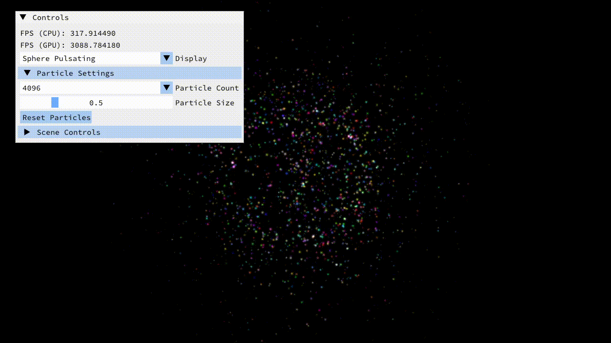

# Particle Simulation Playground

Particle Simulation using OpenGL that utilizes the Vertex & Compute Shader for motion calculation. The simulation is based on the set of defined features that particles abide by and is calculated within the Vertex Shader.

## Features

### Spawning Particle Program

Particles are spawned with random lifetime and position within the defined area. The particles are spawned with a random velocity and color.

### Particle Single Attractor

Particles are attracted to a single attractor point. The attractor point can be moved around the screen.

### Particle Multi Attractor

Particles are attracted to multiple attractor points. The attractor points can be moved around the screen.

### N-Body Simulation

Particles are attracted to each other based on their distance. The particles are attracted to each other based on the inverse square law.

### Mesh Surface Estimation

Particles are attracted to the surface of the mesh. The particles are attracted to a random point on the surface of the mesh.

